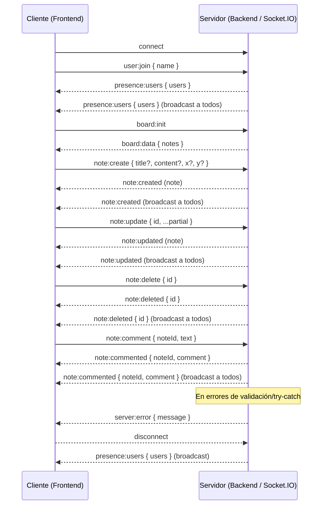

# Realtime Collaboration Board

Aplicación full-stack de pizarra colaborativa en tiempo real.

- Frontend: Vue 3 + Vite + Pinia
- Backend: Node.js (Express) + Socket.IO

---

## Arquitectura del proyecto

### Vista general

- **Frontend (`/frontend`)**
  - Renderiza la UI (board, notas, lista de usuarios).
  - Maneja estado local con **Pinia**.
  - Orquesta el realtime con un **gateway** (`SocketGateway`) y un **controller** (`realtimeController`).

- **Backend (`/backend`)**
  - Expone un endpoint HTTP básico (healthcheck) y un servidor Socket.IO.
  - Mantiene un estado en memoria (`state.users`, `state.notes`).
  - Emite eventos a todos los clientes y persiste notas en un JSON (`board.json`).

### Estructura (alto nivel)

```
Realtime-Collaboration-Board/
  backend/
    server.js
    src/
      socketHandlers.js
      data.js
      persistence.js
      utils.js
      board.json
  frontend/
    vite.config.ts
    src/
      services/
        socket/SocketGateway.ts
        realtime/realtimeController.ts
        realtime/realtimeApi.ts
      stores/
        session.ts
        users.ts
        notes.ts
      components/
      views/
```

### Flujo de datos

- **Cliente** inicia conexión Socket.IO.
- **Cliente** emite:
  - `user:join` (para presencia)
  - `board:init` (para pedir estado inicial)
  - `note:create | note:update | note:delete | note:comment` (acciones)
- **Servidor** actualiza estado en memoria y emite a todos:
  - `presence:users`
  - `board:data`
  - `note:created | note:updated | note:deleted | note:commented`

---

## Diagrama simple de eventos en tiempo real

> Diagrama de intercambio de eventos entre cliente y servidor.



---

## Decisiones técnicas y trade-offs

### Socket.IO (realtime)
- **Decisión**: usar Socket.IO por reconexión automática, fallback de transporte y API por eventos.
- **Trade-off**:
  - Pro: implementación rápida y confiable para realtime.
  - Contra: tipado TS puede ser rígido (en el frontend se usa un cast mínimo en el boundary del gateway para compatibilidad de tipos).

### Estado en memoria + persistencia a JSON
- **Decisión**: guardar el estado principal (`notes`) en memoria para responder rápido.
- **Persistencia**: se serializa a `backend/src/board.json` con un `debounce` (`schedulePersist`).
- **Trade-off**:
  - Pro: simple de correr sin DB.
  - Contra: no escala horizontalmente y puede perder datos ante caídas bruscas antes de persistir.

### Pinia en frontend
- **Decisión**: stores separados (`session`, `users`, `notes`) para responsabilidades claras.
- **Trade-off**:
  - Pro: estado predecible, fácil de testear.
  - Contra: hay que cuidar sincronización con eventos del socket.

---

## Setup de Frontend y Backend

### Backend

Requisitos: Node.js (recomendado LTS).

```bash
cd backend
npm install
npm run dev
```

- URL: `http://localhost:3001/`
- Socket.IO: `ws/http` en `http://localhost:3001`

### Frontend

```bash
cd frontend
npm install
npm run dev
```

- Vite dev server (ver consola para el puerto, típicamente `http://localhost:5173`).
- El frontend se conecta al backend en `http://localhost:3001` (ver `frontend/src/services/realtime/realtimeController.ts`).

### Tests (Frontend)

```bash
cd frontend
npm test
```

Incluye:
- 2 tests de componentes
- 1 test de lógica del store

---

## Limitaciones conocidas

- **Sin autenticación real**: el nombre de usuario se envía como texto y no hay verificación.
- **Persistencia simple**: JSON local (sin DB, sin migraciones, sin control de concurrencia).
- **Sin rooms/boards múltiples**: todo es un único board global.
- **Resolución de conflictos limitada**: se usa `timestamp` para evitar sobrescrituras en algunas rutas (ej. `upsertRemote` en store). No hay CRDT/OT.
- **Escalabilidad**: un solo proceso/instancia; múltiples instancias requieren Redis adapter o mecanismo similar.

---

## Mejoras futuras

- **Rooms por board** (multi-board) usando `io.to(room)` y join por boardId.
- **Persistencia en DB** (PostgreSQL/Mongo) con esquema y endpoints.
- **Autenticación** (JWT / sessions) y autorización por board.
- **Estrategia de concurrencia** más robusta:
  - CRDT/OT para edición colaborativa.
  - Versionado por entidad y resolución de conflictos.
- **Observabilidad**:
  - logging estructurado
  - métricas de conexión/eventos
- **Más tests**:
  - tests de integración del socket handler
  - tests e2e (Playwright/Cypress)
